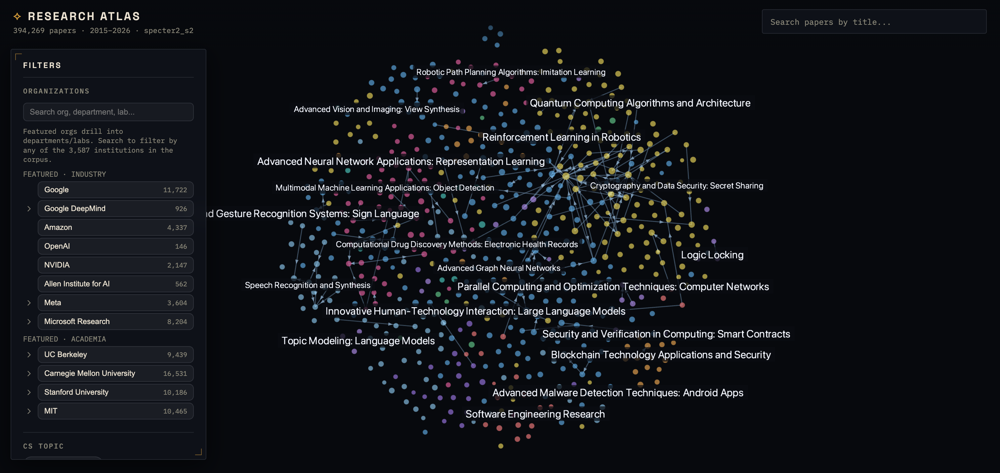
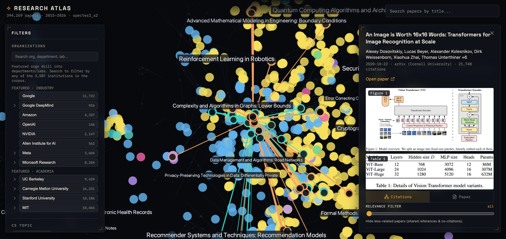

# Research Atlas

A 2D map of CS/AI research papers. Each paper is a point, papers with similar
titles/abstracts sit near each other, and citations are drawn as directed edges. Zooming
works like a map: broad fields when zoomed out, specific topics in the middle, and
micro-clusters of a few papers at the deepest zoom.



Select a paper to see its citation network, related work, and — for arXiv papers — its
Figure 1 and Table 1 pulled straight from the PDF. A slider filters the network down to the
most related papers.



There is no backend. An offline Python pipeline turns OpenAlex + Semantic Scholar data into
a static bundle of Arrow/JSON files, and a React + deck.gl app renders it.

```
OpenAlex + Semantic Scholar  →  pipeline (s00…s13)  →  web/public/data/*  →  deck.gl app
```

## What it does

- **Semantic map** — positions come from SPECTER2 embeddings projected to 2D with openTSNE.
  Nearby points are similar papers.
- **Semantic zoom** — topic regions come from nested Leiden communities over a planar
  substrate, so each region is one contiguous area of the map. Labels reveal finer topics as
  you zoom in.
- **Filters** — organization (drilling into departments/labs), author, CS topic (OpenAlex
  subfield + fine topic), and date. Filters compose and run on the GPU.
- **Selection** — a paper's references and citers are shown as directed edges, weighted by
  importance. A relevance slider (bibliographic coupling + co-citation, like Connected
  Papers) hides the least-related papers gradually.
- **First figure & table** — Figure 1 and Table 1 are cropped from the arXiv PDF. The
  pipeline can bake crops offline (PyMuPDF); otherwise the browser extracts them on demand
  from the PDF operator list via pdf.js.

See [`docs/Features.md`](docs/Features.md) for the full feature list, [`docs/Design.md`](docs/Design.md)
for how it's built, and [`docs/DESIGN_DECISIONS.md`](docs/DESIGN_DECISIONS.md) for the
tradeoffs behind each choice.

## Quick start

### 1. Build the data

Requires Python 3.11 (via [`uv`](https://github.com/astral-sh/uv)).

```bash
uv venv --python 3.11
uv pip install -r pipeline/requirements.txt
# optional local embedding fallback (pulls torch):
uv pip install "sentence-transformers>=3.0" "torch>=2.2"

cp .env.example .env          # set OPENALEX_MAILTO; OPENALEX_API_KEY recommended

uv run python -m pipeline.run_all              # full run
uv run python -m pipeline.run_all --from s04   # resume from a stage
uv run python -m pipeline.run_all --only s06,s07
```

`config.yaml` holds everything configurable (corpus scope, date range, embedding backend,
zoom bands, figure baking). Output lands in `web/public/data/`.

### 2. Run the app

```bash
cd web
npm install
npm run dev        # http://localhost:5173
```

A fresh clone has no data bundle (it's gitignored — it's large and regenerable), so run the
pipeline once first, or the app shows "Failed to load data."

## Pipeline stages

| Stage | Does |
|---|---|
| s00 | resolve org names → OpenAlex institution ids |
| s01 | fetch CS works (field × dates, optionally org-gated) |
| s02 | reconstruct abstracts, dedupe, assign node ids, arXiv-preferred dates |
| s03 | embed (SPECTER2 via Semantic Scholar, SciNCL fallback) |
| s04 | openTSNE 768→2D, freeze the projector |
| s05 | UMAP→10D + HDBSCAN clustering |
| s09 / s08 | citation edges / fused semantic + citation neighbor graph |
| s06 / s07 | nested Leiden communities / topic + phrase labels |
| s12 | reveal levels for overlap-free zoom + on-demand tiles |
| s10 | org / author / topic indexes |
| s13 | (optional) bake Figure 1 crops from arXiv PDFs |
| s11 | assemble the static bundle + manifest |

## Repo layout

```
config.yaml            # single source of truth for the pipeline
pipeline/
  run_all.py           # stage orchestrator (typer CLI)
  common/              # artifact schema, abstract reconstruction, OpenAlex client, figure extract
  embedding/           # swappable backends (specter2_s2, scincl_local)
  directory/           # curated org/department/lab units
  stages/              # s00 … s13
  tests/               # pytest
web/
  src/
    data/              # artifact loader + TS types (mirror of schema.py)
    state/             # zustand store
    map/               # deck.gl MapView + layers (points, edges, labels) + relevance/scores
    filters/           # org / author / topic / date + GPU filter mask
    panels/            # details, citations, figure/table, arXiv preview, related works
  public/data/         # ← pipeline output (gitignored)
```

## Testing

```bash
uv run pytest                    # pipeline unit tests
cd web && npx tsc -b             # frontend typecheck
cd web && npm run test:e2e       # Playwright (desktop + mobile)
```

## Data & licensing

Papers, citations, and topics come from [OpenAlex](https://openalex.org) (CC0); SPECTER2
embeddings from [Semantic Scholar](https://www.semanticscholar.org); figure/table crops and
dates from [arXiv](https://arxiv.org) under its API terms. This project is MIT-licensed (see
[`LICENSE`](LICENSE)); the offline figure stage uses PyMuPDF (AGPL-3.0) — see
[`NOTICE.md`](NOTICE.md) for what that means.

## Status

The checked-in config builds a demonstrator. Known limitations and next work are tracked in
[`docs/TODO.md`](docs/TODO.md) and [`docs/ROADMAP.md`](docs/ROADMAP.md); if you're picking the
project up, start with [`docs/HANDOFF.md`](docs/HANDOFF.md).
